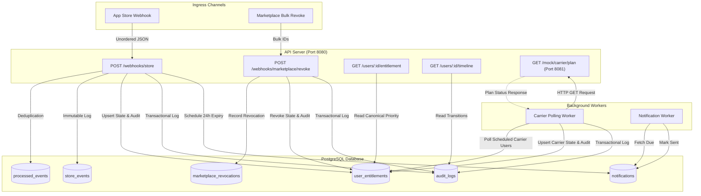

# Premium Entitlement Reconciler

[](https://go.dev/)
[](https://www.postgresql.org/)
[](https://www.docker.com/)

A robust backend service designed to reconcile premium subscriptions from three independent sales channels (in-app store, mobile carrier, and a third-party marketplace) into a single, canonical entitlement state.

## Problem Statement

Premium access for a user can be granted or revoked concurrently by any of three distinct channels:
1. **In-app store**: Pushes webhooks (guarantees at-least-once delivery, unordered, and events may occasionally arrive days late).
2. **Mobile carrier**: Does not support webhooks; requires schedule-based API polling to ascertain plan status.
3. **Third-party marketplace**: Pushes a bulk revocation request once per month.

The core responsibility of this service is to ingest these disparate signals and maintain the canonical truth to accurately answer: *"Is this user premium right now, and why?"*

## Architecture

> [!NOTE]
> The service utilizes a **hybrid event model** where immutable event history is paired with a mutable canonical projection for high-performance reads.



### Design Principles

- **Hybrid Event Model**: Immutable event history combined with a mutable canonical projection.
  - `store_events`, `marketplace_revocations`, `processed_events`: Insert-only (never modified).
  - `user_entitlements`: Fast-read projection representing current state per source.
- **Multiple Simultaneous Sources**: A user can simultaneously be active via `STORE` and inactive via `MARKETPLACE`.
- **Source Isolation**: A marketplace revocation exclusively affects the `MARKETPLACE` source; carrier polling exclusively affects the `CARRIER` source.
- **Deterministic Priority**: The API returns a single canonical source using the priority: `STORE > CARRIER > MARKETPLACE > NONE`.

### Key Features

- **Idempotency**: All external events are deduplicated via atomic constraints. `InsertStoreEvent` and `InsertMarketplaceRevocation` use `ON CONFLICT DO NOTHING` as an atomic gate to prevent race conditions.
- **Timestamp-based Ordering**: `STORE` events are strictly ordered by `event_time_ms` (from the webhook payload), entirely ignoring arrival time.
- **Late-Arriving Events**: Safely persisted for auditing but prevented from overwriting newer active states without causing constraint violations.
- **Worker Concurrency**: Carrier polling and Notification scheduling employ PostgreSQL's `FOR UPDATE SKIP LOCKED` for thread-safe, lock-free concurrent worker execution.
- **Notification Deduplication**: Database constraints strictly guarantee at most one expiration notification per user per day.

---

## Quick Start

### Prerequisites

- Docker Engine 29.5.2+
- Docker Compose 2.36.1+

### Run Everything

Spin up the entire stack with a single command:

```bash
docker compose up -d
```

This starts:
- PostgreSQL 18.4 Database
- API Server (`http://localhost:8080`)
- Background Worker (Carrier Polling & Notifications)
- Mock Carrier API (`http://localhost:8081`)
- Database Migration Utility (`migrate/migrate`)

### Local Development

> [!TIP]
> Ensure a local PostgreSQL instance is running before starting the API or worker manually.

```bash
# Install dependencies
go mod download

# Run linter
make lint

# Run integration tests
make test

# Build binaries
make build

# Run API locally
make run-api

# Run worker locally
make run-worker
```

---

## API Endpoints

### Health Check

Verify the API is running and healthy.

```http
GET /health
```

**Response (200 OK):**
```text
OK
```

### Store Webhook

Ingest an event from the in-app store. 

```http
POST /webhooks/store
Content-Type: application/json

{
  "eventId": "evt_abc123",
  "userId": "u_42",
  "type": "INITIAL_PURCHASE",
  "eventTimeMs": 1716700000000,
  "productId": "premium_monthly"
}
```

> [!IMPORTANT]
> Handles duplicate events idempotently, safely reorders out-of-order deliveries, and accepts late arrivals without mutating newer state.

### Marketplace Revoke

Revoke marketplace-granted access in bulk.

```http
POST /webhooks/marketplace/revoke
Content-Type: application/json

{
  "userIds": ["u_42", "u_91", "u_133"]
}
```

### Get User Entitlement

Fetch the canonical entitlement state.

```http
GET /users/{userId}/entitlement
```

**Response:**
```json
{
  "active": true,
  "source": "STORE",
  "expiresAt": "2026-06-10T00:00:00Z",
  "lastChangedAt": "2026-05-20T11:23:00Z",
  "reason": "RENEWAL"
}
```
*Note: Returns the highest-priority active source (`STORE > CARRIER > MARKETPLACE`).*

### Timeline (Stretch Goal)

Fetch the reconstructed history of entitlement changes for a specific user.

```http
GET /users/{userId}/timeline
```

---

## Testing with cURL

Once the application is running via Docker Compose, verify the functionality with the following shell commands.

### 1. In-App Store Webhooks

**Initial Purchase (Active)**
```bash
TIMESTAMP=$(( $(date +%s) * 1000 ))

curl -X POST http://localhost:8080/webhooks/store \
  -H "Content-Type: application/json" \
  -d '{
    "eventId": "evt_store_purchase_001",
    "userId": "user_store_1",
    "type": "INITIAL_PURCHASE",
    "eventTimeMs": '$TIMESTAMP',
    "productId": "premium_monthly"
  }'
```

**Duplicate Event Ingestion (Idempotency)**
Run the same command above again. It will return `"isDuplicate": true`.

**Out-of-Order / Late-Arriving Event**
Simulate a late-arriving event (e.g., 20 seconds in the past):
```bash
TIMESTAMP=$(( ($(date +%s) - 20) * 1000 ))

curl -X POST http://localhost:8080/webhooks/store \
  -H "Content-Type: application/json" \
  -d '{
    "eventId": "evt_store_late_billing_002",
    "userId": "user_store_1",
    "type": "BILLING_ISSUE",
    "eventTimeMs": '$TIMESTAMP',
    "productId": "premium_monthly"
  }'
```
*(Accepted for logging but will not overwrite the active purchase status.)*

### 2. Entitlement Queries

```bash
curl http://localhost:8080/users/user_store_1/entitlement
```

### 3. Marketplace Bulk Revoke

```bash
curl -X POST http://localhost:8080/webhooks/marketplace/revoke \
  -H "Content-Type: application/json" \
  -d '{
    "userIds": ["user_market_1", "user_market_2"]
  }'
```

### 4. Carrier Polling Mock

Query the mock carrier to observe its randomized outputs. (Note: The mock carrier runs on port 8081 as a lightweight container using `MOCK_CARRIER_MODE=true`).
```bash
curl "http://localhost:8081/mock/carrier/plan?userId=user_carrier_1"
```

### 5. Transition Timeline / Audit Trail

```bash
curl http://localhost:8080/users/user_store_1/timeline
```

---

## Design Decisions

| Decision | Rationale |
|----------|-----------|
| **Hybrid Event Model** | A pure event-sourcing model requires costly state-rebuilding on reads. Using immutable tables (`store_events`, `audit_logs`) alongside a mutable projection (`user_entitlements`) perfectly balances absolute auditability with `O(log n)` query performance. |
| **Composite PK on `user_entitlements`** | Allows seamless tracking of multiple simultaneous sources. A user can easily be `active` via STORE and `inactive` via MARKETPLACE without destructive updates. |
| **Deterministic Priority** | The API is forced to return a single source. `STORE > CARRIER > MARKETPLACE > NONE` provides a deterministic resolution to overlapping active entitlements. |
| **Ordering via `event_time_ms`** | In-app store webhooks offer no ordering guarantees. By strictly applying state changes based on payload timestamps (rather than arrival), late-arriving events naturally do not corrupt newer data. |
| **Worker Concurrency** | PostgreSQL's `FOR UPDATE SKIP LOCKED` allows multiple polling workers to safely pull independent user batches simultaneously without blocking or double-polling. |
| **Notification Deduplication** | Leveraging `ON CONFLICT DO NOTHING` alongside an `IMMUTABLE` functional index ensures that deduplication logic is atomic and race-condition free at the database level. |

---

## Tradeoffs & Production Considerations

### What Would Change with Another Week?

1. **Richer Observability**: Integration with OpenTelemetry (Prometheus/Grafana) to monitor reconciliation latency, webhook queue depths, and error rates.
2. **Webhook Retry Logic**: Implement an exponential backoff retry strategy for failed webhooks to ensure eventual consistency.
3. **Carrier API Caching**: Cache recent carrier responses to heavily reduce outbound load during bulk worker polling.
4. **Rate Limiting**: Defend the webhook ingestion routes with per-user and global rate limiting.
5. **Payload Verification**: Introduce HMAC signature verification middleware for marketplace webhooks to guarantee authenticity.

---

## Project Structure

```text
.
├── cmd/
│   ├── api/                   # API server entrypoint
│   └── worker/                # Background job runner entrypoint
├── internal/
│   ├── application/           # Service layer & reconciliation business logic
│   ├── config/                # Shared configuration and helpers
│   ├── domain/                # Domain entities & types
│   └── infrastructure/
│       ├── carrier/           # Carrier API client implementation
│       ├── http/              # HTTP routers and handlers
│       ├── postgres/          # SQL repository implementations
│       └── worker/            # Job polling implementations
├── migrations/                # Database migrations
├── sql/
│   └── queries/               # sqlc raw query templates
├── tests/                     # Integration tests (Testcontainers)
├── Makefile                   # Build/Dev shortcuts
├── docker-compose.yml         # Container orchestration
└── Dockerfile                 # Multi-stage build definitions
```
